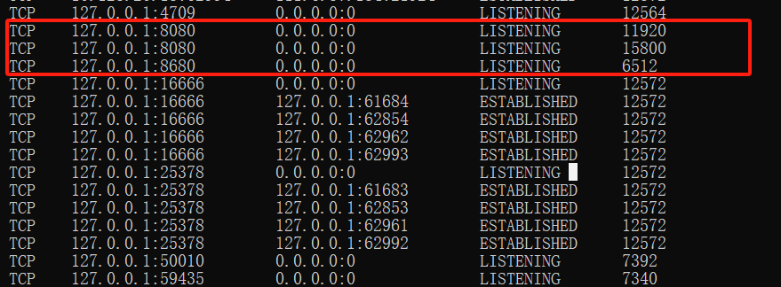
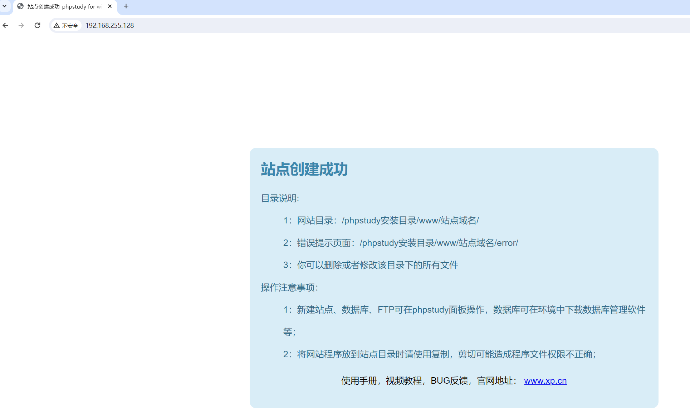
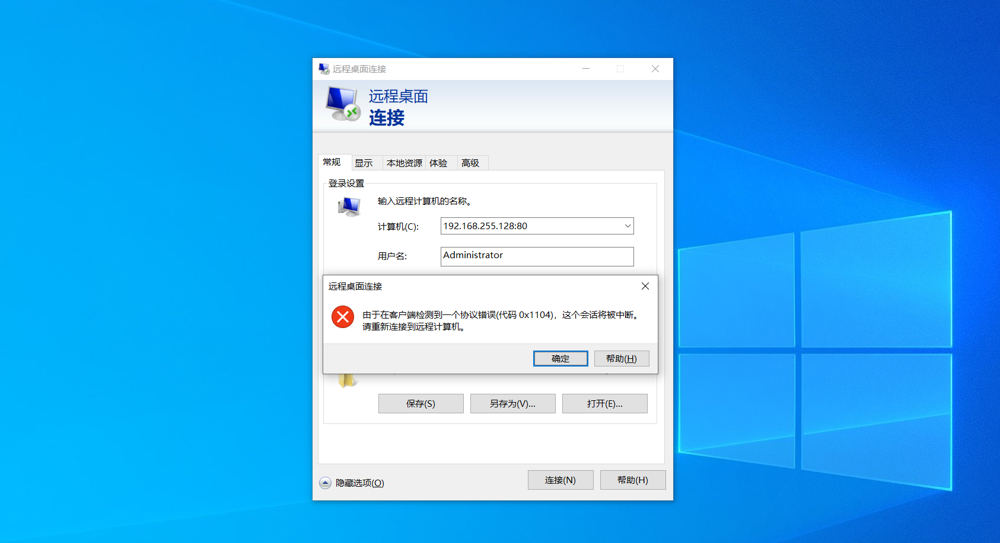
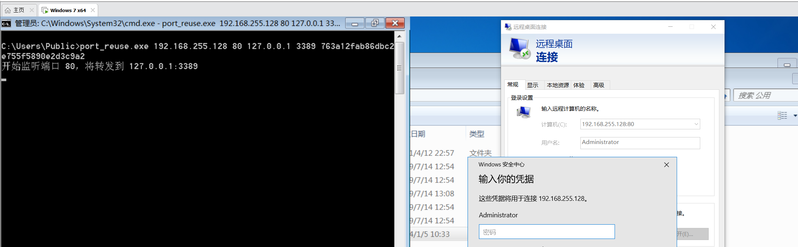
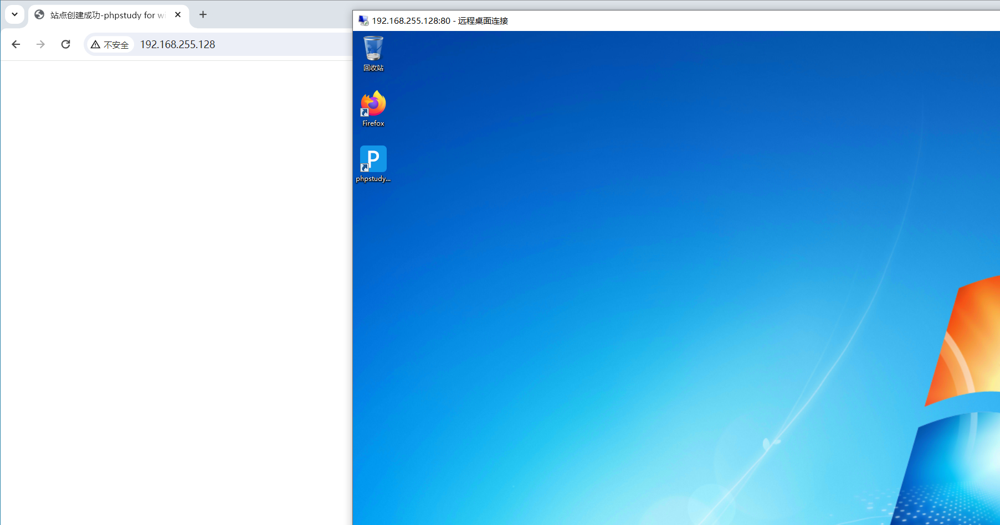

### 前言

主要是在项目中遇到以下问题(以均不出网得场景下)：

+ 外网打点遇到内网不出网，代理慢的一批，不管是**rdp**、**ssh**还是**http**等连接均卡得不行。

+ 内网环境遇到强隔离，双方只有个别端口能通无法做二层代理。使用**Neo-reGeorg**代理又太慢，尤其是正向加正向代理。

我的解决思路是遇到**jsp**还好可以使用**suo5**，遇到别的语言确实只能使用**Neo-reGeorg**。在网上也看到了端口分流的工具，但是依赖于防火墙进行流量转发，所以就衍生了以下工具。

## Port reuse

我们知道，一般来说在我们启动一个新的端口，如果当前端口已被占用，就会出现以下错误。

```
Error: listen tcp 127.0.0.1:8080: bind: Only one usage of each socket address (protocol/network address/port) is normally permitted.
```

​	这是由于默认的情况下，在操作系统中，当我们尝试打开一个网络连接时，需要指定源地址和端口。如果我们试图打开一个具有与已经打开的套接字相同的源地址和端口的新套接字（socket），操作系统就会报错，因为同一个源地址和端口不能被多个套接字同时使用。这是出于网络通信的规则和限制，以确保数据传输的正确性和有序性。

​	换句话说，每个网络连接都需要独一无二的源地址和端口，以确保数据正确地到达目标地点。如果两个套接字尝试使用相同的源地址和端口，就会导致冲突，因此操作系统不允许这种情况发生。这样的限制有助于避免数据混乱和网络通信的混乱状态。

​	然而，根据TCP/IP标准，端口本身是允许复用的。绑定端口的本质是，当系统接收到一个TCP报文段或UDP数据报时，可以根据其头部的端口字段找到对应的进程，并将数据传递给相应的进程。此外，对于广播和组播，端口复用是必须的，因为它们本身就是多重交付的情况。

​	在这个背景下，`SO_REUSEPORT` 和 `SO_REUSEADDR` 是两个套接字选项，它们允许在特定情况下重新使用端口：

- **SO_REUSEPORT：** 允许多个套接字同时绑定到相同的地址和端口，可以同时接收传入的连接，适用于实现负载均衡或者多进程/线程同时监听同一端口的场景。
- **SO_REUSEADDR：** 允许在一个套接字使用过程中被终止后，其他套接字可以立即再次绑定到相同的地址和端口，有助于在服务器重启后快速恢复服务。

### 工具的实现

​	首先来看代码我们可以通过`"golang.org/x/sys/windows"`库来指定`SO_REUSEADDR`。

```go
var lc = net.ListenConfig{
	Control: func(network, address string, c syscall.RawConn) error {
		var opErr error
		if err := c.Control(func(fd uintptr) {
			opErr = windows.SetsockoptInt(windows.Handle(fd), windows.SOL_SOCKET, windows.SO_REUSEADDR, 1)
		}); err != nil {
			return err
		}
		return opErr
	},
}
```

接着我们直接监听，运行测试以下

```go
l, err := lc.Listen(context.Background(), "tcp", laddr)
```




我们可以看出以上不同的进程来监听同一个程序。那么端口复用到底又什么用的。我们可以进行以下实验。

首先我们80端口启动一个web服务，来模拟实战环境下内网不出网，同时只能访问web端口的情况。




我们通过mstsc来连接80端口，正常情况下是肯定连接不通的。




当我们开启端口复用的时候同时来复用3389端口来看看。可以看出我们通过连接`192.168.255.128:80`也能跟3389建立连接。



同时也不影响web端口的正常服务使用



如果我们建立的长连接，只需在建立长连接之后把监听的复用端口给Close掉也是不影响rdp的操作的。我这里设置的是默认2分钟关闭端口复用。

```go
l, err := lc.Listen(context.Background(), "tcp", laddr)
go func() {
    time.Sleep(2 * time.Minute)
    l.Close()
    if timeout == 1 {
        os.Exit(0)
    }
}()
```

注：不能复用IIS和3389端口。

## `windows` ：使用方法 

help ： ```port_reuse.exe  port_reuse.exe```


port_reuse.exe [lhost] [reuse prot] [rhost] [rport] [md5(myip)]

默认两分钟关闭端口复用，如有需要自行修改。（长连接的请求，关闭端口复用以后不影响当前建立的长连接）

其中myip为指定一个访问他端口的IP,只有通过这个IP访问才会跳转复用端口，否则访问还是原来的业务。

不依赖防火墙，注意使用管理员权限执行


## `linux` ：使用方法 

help ： ```./port_reuse_linux ./port_reuse_linux```

请自行测试那些端口可以复用


## 扩展

根据此项目扩展的端口复用Socks5
**https://github.com/p1d3er/ReuseSocks**
**仅供技术研究使用，请勿用于非法用途，否则后果作者概不负责**
